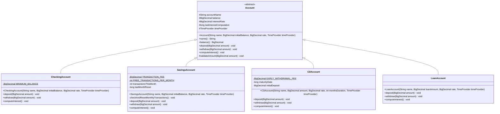
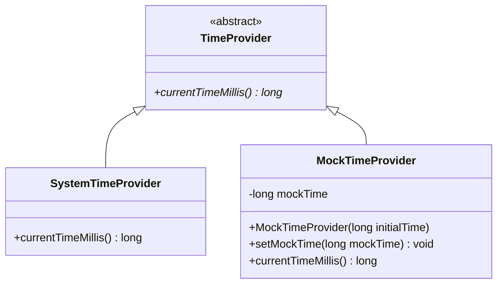
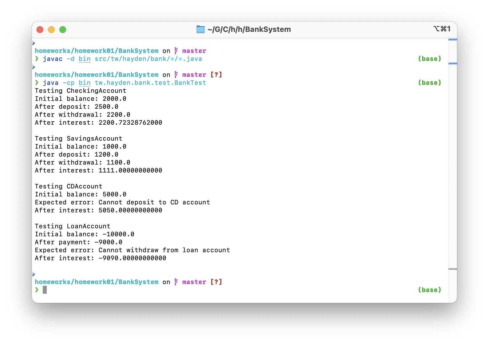

# Bank System in Java

> NTUST Course Homework
> Homework Name: [Programming assignment 1 (Java)](https://faculty.csie.ntust.edu.tw/~ywu/cs4001301/PA1.TXT)
>
> Course Name: Programming Languages
> Course No: CS4001301
> Course Teacher: Yi-Leh Wu
>
> Student Name: Hayden Chang 張皓鈞
> Student ID: B11030202

## System Design

### Account Models

- **Account：** Abstract base class that defines attributes and methods common to all accounts.
- **CheckingAccount：** Checking account with daily interest.
- **SavingsAccount：** Savings account with monthly interest.
- **CDAccount：** Time deposits, fixed maturity.
- **LoanAccount：** Loan Account, Negative Balance.

### Exception

- **BankException：** Simple error types for error handling

### Time Provider

- **TimeProvider：** Abstract base class that provides a `currentTimeMillis` method to get the current time.
- **SystemTimeProvider：** The default implementation. Used in production environments. Returns the system time.
- **MockTimeProvider：** Used in test environments. Allows the test program to customize the time.

## UML

### Account



### Time Provider




## Compile

```bash
javac -d bin src/tw/hayden/bank/*/*.java
```

## Run Test Case

```bash
java -cp bin tw.hayden.bank.test.BankTest
```

### Result

```
Testing CheckingAccount
Initial balance: 2000.0
After deposit: 2500.0
After withdrawal: 2200.0
After interest: 2200.72328762000

Testing SavingsAccount
Initial balance: 1000.0
After deposit: 1200.0
After withdrawal: 1100.0
After interest: 1111.00000000000

Testing CDAccount
Initial balance: 5000.0
Expected error: Cannot deposit to CD account
After interest: 5050.00000000000

Testing LoanAccount
Initial balance: -10000.0
After payment: -9000.0
Expected error: Cannot withdraw from loan account
After interest: -9090.00000000000

```



